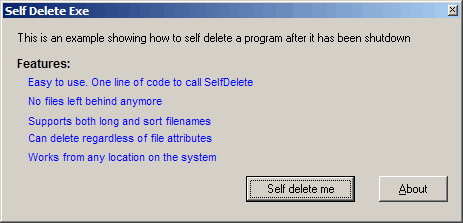



## DM Self Delete Program

### Description

Self Delete is a small example of how to delete a program after it's been closed. I seen many examples. but none that do the trick for me. ok this example. allows you delete files regardless of sort or long filenames deletes from any location, Deletes regardless of file attributes. all code is commented and easy to use. hope you like it.
 
### More Info
 

             |
---                |---
**Submitted On**   |2000-08-31 08:49:48
**By**             |[dreamvb](https://github.com/Planet-Source-Code/PSCIndex/blob/master/ByAuthor/dreamvb.md)
**Level**          |Beginner
**User Rating**    |4.7 (14 globes from 3 users)
**Compatibility**  |VB 5\.0, VB 6\.0
**Category**       |[Files/ File Controls/ Input/ Output](https://github.com/Planet-Source-Code/PSCIndex/blob/master/ByCategory/files-file-controls-input-output__1-3.md)
**World**          |[Visual Basic](https://github.com/Planet-Source-Code/PSCIndex/blob/master/ByWorld/visual-basic.md)
**Archive File**   |[DM\_Self\_De1928808312005\.zip](https://github.com/Planet-Source-Code/dreamvb-dm-self-delete-program__1-62393/archive/master.zip)

